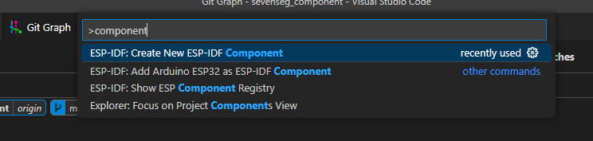
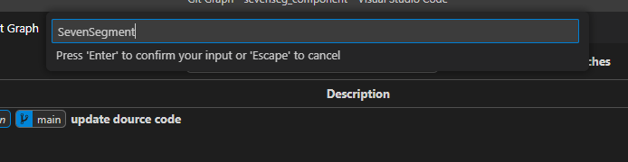
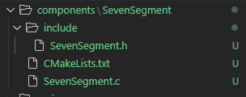
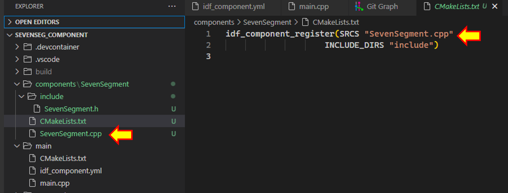

# Lab 6-2

## 1 สร้าง idf component ใหม่ 

1.1 สร้าง idf component ใหม่ โดยตั้งชื่อ `SevenSegment` 

1.2 เรียกเมนู View -> command palette...

1.3  พิมพ์ component แล้วเลือก `ESP-IDF: Create New ESP-IDF Component` 



1.4 พิมพ์ `SevenSegment` แล้วกด  enter



จะได้ source code ของ component มาเป็น folder



1.5 แก้ไข component  ให้เป็นภาษา C++



1.6 ทดสอบ build โปรแกรม ควรจะ  build ผ่าน


## 2 สร้าง คลาสสำหรับ 7 segment  

2.1 เพิ่มการประกาศคลาสในไฟล์ `SevenSegment.h`
```cpp
#include "LED.h"
#include "freertos/FreeRTOS.h"
#include "freertos/task.h"
class SevenSegment
{
    int common_pin;
    LED seg_a = LED(16);
    LED seg_b = LED(17);
    LED seg_c = LED(5);
    LED seg_d = LED(18);
    LED seg_e = LED(19);
    LED seg_f = LED(21);
    LED seg_g = LED(22);
    LED common = LED(common_pin);
public:
    SevenSegment(int pin)
    {
        common_pin = pin;
        common = LED(common_pin);
    } 
    void HardwareTest();
    void DisplayBlank();
};
```

2.2 เพิ่ม function ใน `SevenSegment.cpp`

```cpp
#include <stdio.h>
#include "SevenSegment.h"

void SevenSegment::HardwareTest()
{
    common.ON();
    seg_a.ON();
    vTaskDelay(500/portTICK_PERIOD_MS);
    seg_b.ON();
    vTaskDelay(500/portTICK_PERIOD_MS);
    seg_c.ON();
    vTaskDelay(500/portTICK_PERIOD_MS);
    seg_d.ON();
    vTaskDelay(500/portTICK_PERIOD_MS);
    seg_e.ON();
    vTaskDelay(500/portTICK_PERIOD_MS);
    seg_f.ON();
    vTaskDelay(500/portTICK_PERIOD_MS);
    seg_g.ON();
    vTaskDelay(500/portTICK_PERIOD_MS);
}

void SevenSegment::DisplayBlank()
{
    common.ON();
    seg_a.OFF();
    seg_b.OFF();
    seg_c.OFF();
    seg_d.OFF();
    seg_e.OFF();
    seg_f.OFF();
    seg_g.OFF();
}
```

## 3. ทดสอบโปรแกรมใน main.cpp

3.1 แก้ไข  code  ใน main.cpp

```cpp
#include <stdio.h>
#include "SevenSegment.h"

SevenSegment s1(0) ;
SevenSegment s2(4) ;

extern "C" void app_main(void)
{
    while(1)
    {
        s1.HardwareTest();
        vTaskDelay(500/portTICK_PERIOD_MS);
        s1.DisplayBlank();
        vTaskDelay(500/portTICK_PERIOD_MS);
    } 
}
```

สังเกตุและบันทึกผลการทดลอง (ส่ง link วิดิโอ)


3.2 แก้ไข  code  ใน main.cpp

```cpp
#include <stdio.h>
#include "SevenSegment.h"

SevenSegment s1(0) ;
SevenSegment s2(4) ;

extern "C" void app_main(void)
{
    while(1)
    {
        s2.HardwareTest();
        vTaskDelay(500/portTICK_PERIOD_MS);
        s2.DisplayBlank();
        vTaskDelay(500/portTICK_PERIOD_MS);
    } 
}
```

สังเกตุและบันทึกผลการทดลอง (ส่ง link วิดิโอ)


3.3 แก้ไข  code  ใน main.cpp

```cpp
#include <stdio.h>
#include "SevenSegment.h"

SevenSegment s1(0) ;
SevenSegment s2(4) ;

extern "C" void app_main(void)
{
    while(1)
    {
        s1.HardwareTest();
        vTaskDelay(500/portTICK_PERIOD_MS);
        s1.DisplayBlank();
        vTaskDelay(500/portTICK_PERIOD_MS);
        s2.HardwareTest();
        vTaskDelay(500/portTICK_PERIOD_MS);
        s2.DisplayBlank();
        vTaskDelay(500/portTICK_PERIOD_MS);
    } 
}
```

สังเกตุและบันทึกผลการทดลอง (ส่ง link วิดิโอ)

