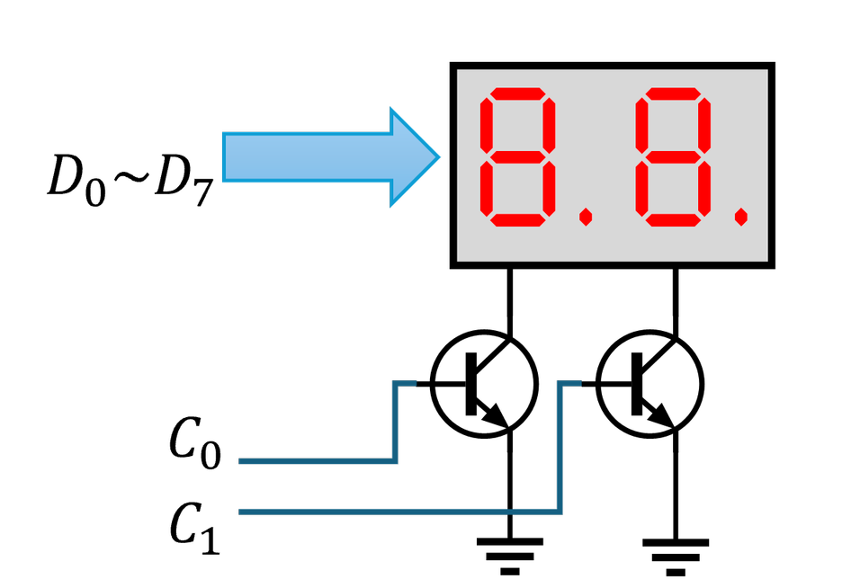

# ESP32 Seven Segment Component

ลิงค์งาน ไฟร์ บน GIT HUB

https://github.com/AnchisaPhetnoi/LAB__6.git

## ตารางความจริงสำหรับการแสดงผลตัวเลข 7 ส่วน   

|             Digit              | a  | b  | c  | d  | e  | f  | g  | dp |
|--------------------------------|----|----|----|----|----|----|----|----|
| | On | On | On | On | On | On |    |    |
| |    | On | On |    |    |    |    |    |
| | On | On |    | On | On |    | On |    |
| | On | On | On | On |    | On |    |    |
| |    | On | On |    |    | On | On |    |
| | On |    | On | On |    | On | On |    |
| | On |    | On | On | On | On | On |    |
| | On | On | On |    |    |    |    |    |
| | On | On | On | On | On | On | On |    |
| | On | On | On | On |    | On | On |    |

# วงจรที่ใช้ในการทดลอง

## [ใบงานที่ 6-1 การทดสอบ hardware](./Lab6-1.md) 
